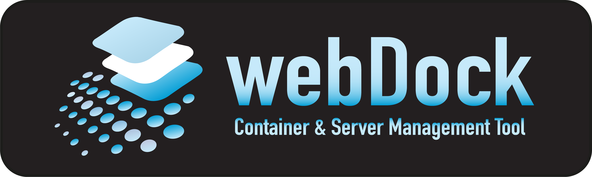
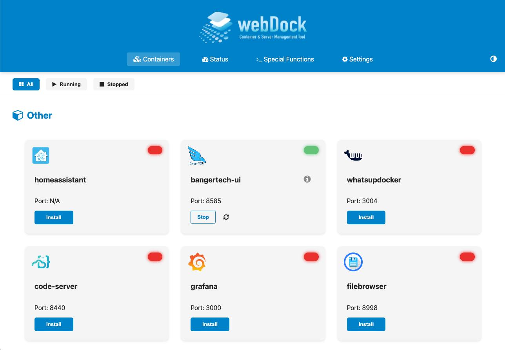
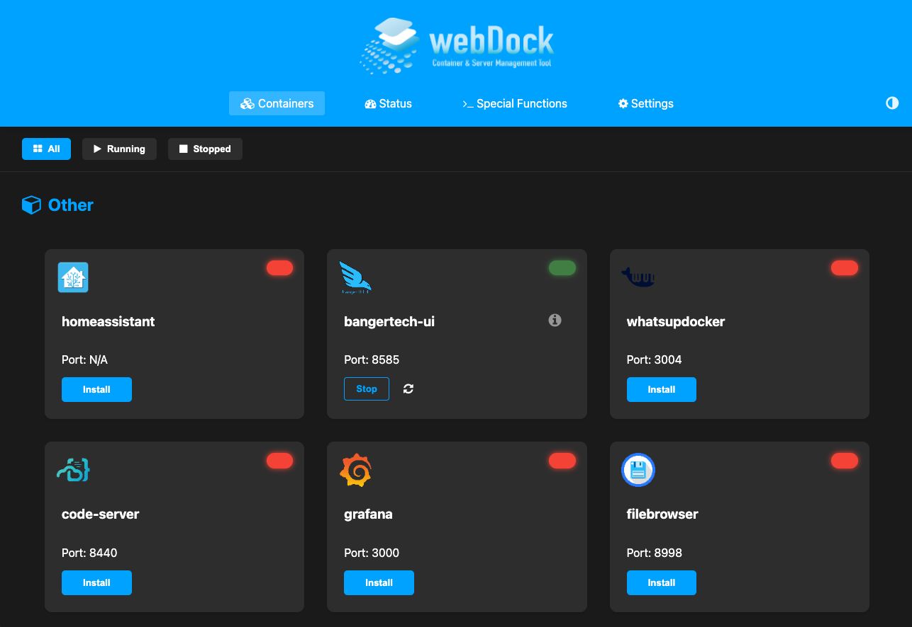
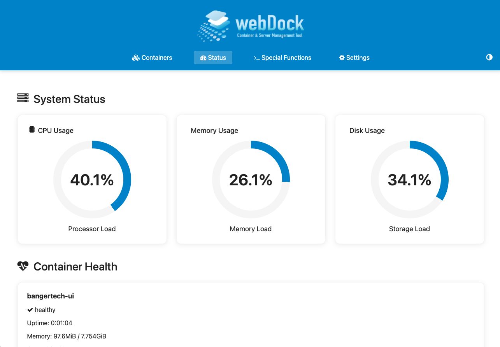
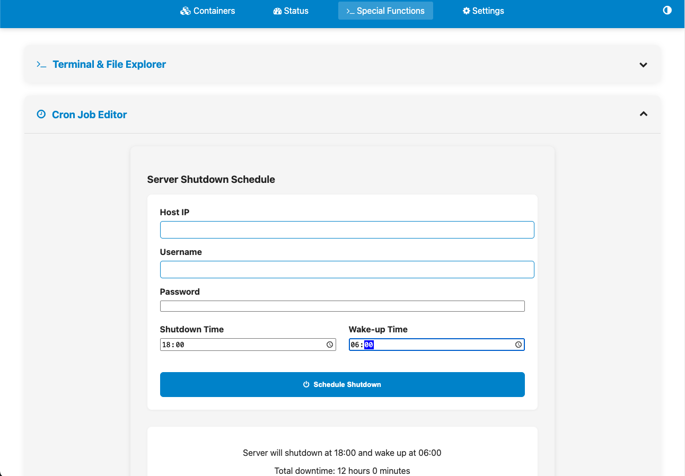

# webDock


[](LICENSE)



> 🐳 A modern web interface for managing Docker containers and services on Debian-based systems

## Screenshots

 

 

## Table of Contents
- [What is webDock?](#what-is-webdock)
- [Setup & Requirements](#setup--requirements)
- [Usage](#usage)
- [Support / Feedback](#support--feedback)
- [Contributing](#contributing)
- [Sponsorship](#sponsorship)

## What is webDock?
webDock is a powerful tool for managing and installing software on Debian-based systems. It provides a user-friendly interface for managing Docker containers and other software solutions.

### Features
- 🚀 One-click container deployment
- 🔄 Automatic container updates
- 📊 System monitoring and statistics
- 🌙 Dark/Light theme support
- 🔧 Easy configuration management
- 📱 Responsive design

### Supported Containers
1. **openHABian** - Smart Home Automation
2. **Docker + Docker-Compose** - Container Orchestration
3. **openHAB-Docker** - openHAB in a Docker container
4. **Frontail** - Log viewer for openHAB
5. **Mosquitto Broker** - MQTT broker for IoT devices
6. **Zigbee2MQTT** - Zigbee to MQTT bridge
7. **Grafana** - Visualization and monitoring
8. **influxDB** - Time series database
9. **Portainer** - Docker management UI
10. **Filestash** - Web-based file manager
11. **Heimdall** - Application dashboard
12. **HomeAssistant** - Open-source home automation
13. **RaspberryMatic** - Homematic central unit
14. **CodeServer** - VS Code in the browser
15. **Prometheus** - Monitoring and alerting
16. **node-exporter** - System metrics for Prometheus
17. **Whats up Docker** - Docker container monitoring
18. **WatchYourLAN** - Network monitoring
19. **Backup** - Backup solutions for Linux and ARM
20. **shut-wake Script** - Automatic shutdown and wake-up of systems

## Technologies
- Python 3.9+
- Flask web framework
- Docker & Docker Compose
- JavaScript (ES6+)
- YAML for configuration

## Setup & Requirements
- **sudo** should be installed
- **$USER** needs to be a member of the _sudo_ group
- Add **%sudo  ALL=(ALL) NOPASSWD:ALL** with _visudo_
- Docker + Docker-Compose are **required** for all container-based programs

## Usage

### For X86 Systems:
1. Navigate to your home directory:
   ```bash
   cd $HOME
   ```
2. Download the setup script:
   ```bash
   sudo wget https://raw.githubusercontent.com/BangerTech/weDock/development/setup_webui.sh
   ```
3. Make the script executable:
   ```bash
   sudo chmod +x setup_webui.sh
   ```
4. Run the setup script:
   ```bash
   sh setup_webui.sh
   ```
5. Pick a program and follow the steps presented by the tool.

## Support / Feedback
Any bugs or feature requests? Contact me [here](https://github.com/bangertech) or click on the "Issues" tab in the GitHub repository!

## Contributing
Fork the repository and create pull requests.

## Sponsorship

<a href="https://www.paypal.com/cgi-bin/webscr?cmd=_s-xclick&hosted_button_id=FD26FHKRWS3US" target="_blank"></a>

## Keywords
`docker-management` `container-management` `web-ui` `docker-compose` `system-monitoring` 
`home-automation` `iot` `smart-home` `monitoring` `dashboard` `debian` `raspberry-pi` 
`docker-gui` `container-deployment` `devops` `self-hosted` `open-source`
